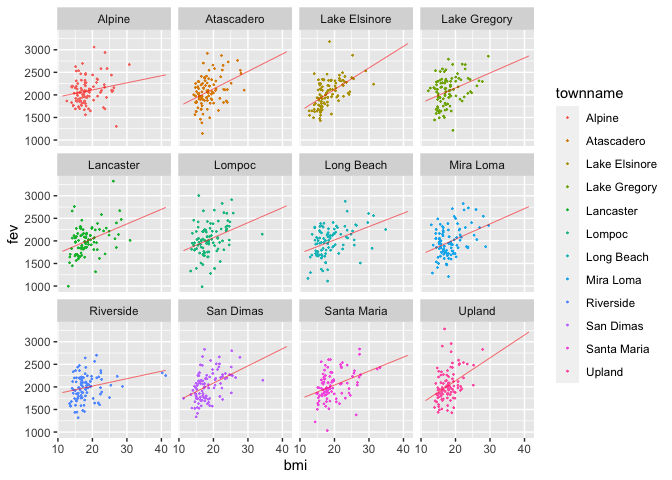
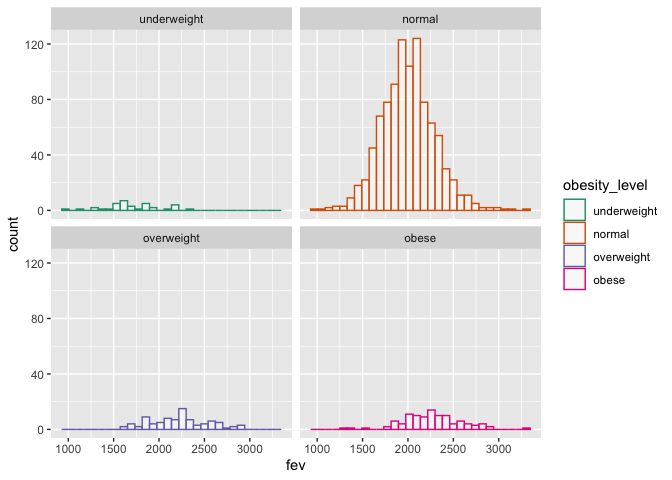
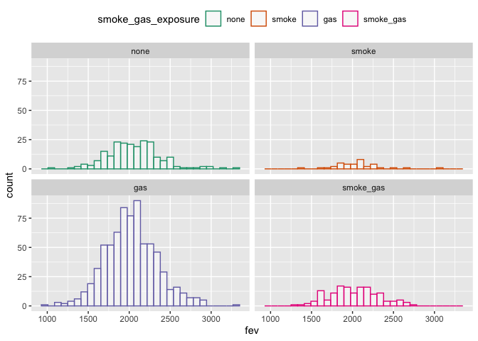
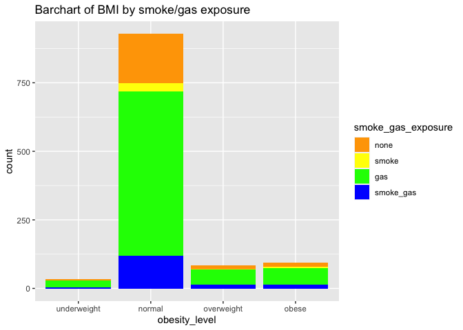
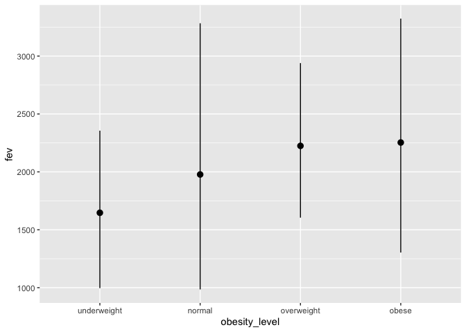
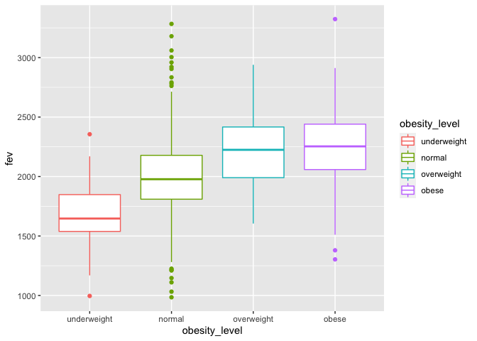
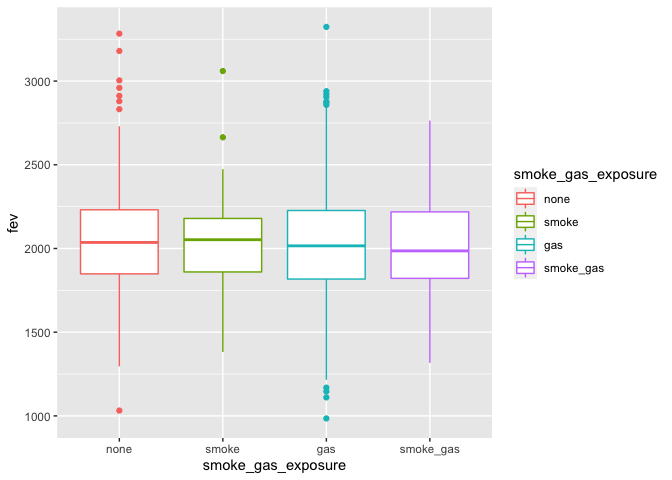
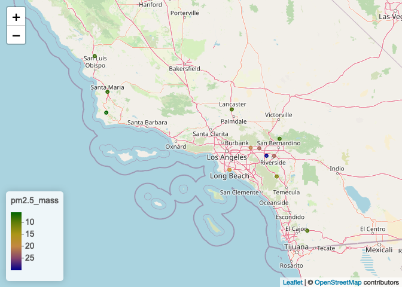
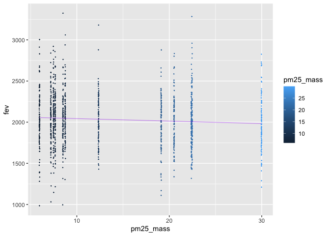
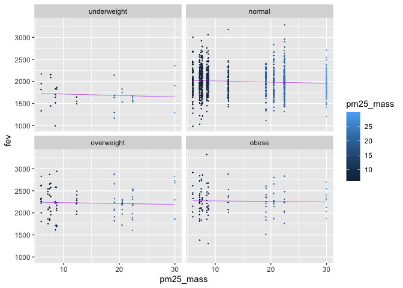

Assignment 02
================
Xiaofan Zhu
2022-10-07

``` r
library(data.table)
library(tidyverse)
library(dtplyr)
library(leaflet)
knitr::opts_chunk$set(echo = TRUE)
library(R.utils)
library(lubridate)
library(tidytext)
library(ggplot2)
```

## Read in the data

``` r
if(!file.exists("individual.csv")){
  download.file(url = "https://raw.githubusercontent.com/USCbiostats/data-science-data/master/01_chs/chs_individual.csv",
               destfile = "individual.csv",
               method = "libcurl",
               timeout = 60)
}
if(!file.exists("regional.csv")){
  download.file(url = "https://raw.githubusercontent.com/USCbiostats/data-science-data/master/01_chs/chs_regional.csv",
               destfile = "regional.csv",
               method = "libcurl",
               timeout = 60)
}

#Read data tables
individual <- fread("individual.csv")
regional <- fread("regional.csv")
```

## Data Wrangling

# 1. After merging the data, make sure you don’t have any duplicates by counting the number of rows. Make sure it matches.

``` r
# check dimensions
dim(individual)
```

    ## [1] 1200   23

``` r
dim(regional) 
```

    ## [1] 12 27

``` r
# merge data
mergedata <- merge(x = individual, y = regional, by.x = "townname", by.y = "townname")
```

``` r
# check dimensions
dim(mergedata)
```

    ## [1] 1200   49

After merging the data, there are still 1200 rows. Therefore, there is
no duplicates.

``` r
# In the case of missing values, impute data using the average within the variables “male” and “hispanic.”
which(colSums(is.na(mergedata)) > 0)
```

    ##        agepft        height        weight           bmi        asthma 
    ##             6             7             8             9            10 
    ## father_asthma mother_asthma        wheeze      hayfever       allergy 
    ##            12            13            14            15            16 
    ##   educ_parent         smoke      gasstove           fev           fvc 
    ##            17            18            20            21            22 
    ##          mmef       no_24hr      pm2_5_fr 
    ##            23            43            44

``` r
summary(mergedata$bmi)
```

    ##    Min. 1st Qu.  Median    Mean 3rd Qu.    Max.    NA's 
    ##   11.30   15.78   17.48   18.50   20.35   41.27      89

``` r
summary(mergedata$fev)
```

    ##    Min. 1st Qu.  Median    Mean 3rd Qu.    Max.    NA's 
    ##   984.8  1809.0  2022.7  2031.3  2249.7  3323.7      95

``` r
# There are 89 NAs in the column of bmi and 95 NAs in the column of fev.
```

``` r
mean(is.na(mergedata$bmi))
```

    ## [1] 0.07416667

``` r
mean(is.na(mergedata$fev))
```

    ## [1] 0.07916667

``` r
# We can find 7.4% and 7.9% of the data is missing.
```

``` r
summary(is.na(mergedata))
```

    ##   townname          sid             male            race        
    ##  Mode :logical   Mode :logical   Mode :logical   Mode :logical  
    ##  FALSE:1200      FALSE:1200      FALSE:1200      FALSE:1200     
    ##                                                                 
    ##   hispanic         agepft          height          weight       
    ##  Mode :logical   Mode :logical   Mode :logical   Mode :logical  
    ##  FALSE:1200      FALSE:1111      FALSE:1111      FALSE:1111     
    ##                  TRUE :89        TRUE :89        TRUE :89       
    ##     bmi            asthma        active_asthma   father_asthma  
    ##  Mode :logical   Mode :logical   Mode :logical   Mode :logical  
    ##  FALSE:1111      FALSE:1169      FALSE:1200      FALSE:1094     
    ##  TRUE :89        TRUE :31                        TRUE :106      
    ##  mother_asthma     wheeze         hayfever        allergy       
    ##  Mode :logical   Mode :logical   Mode :logical   Mode :logical  
    ##  FALSE:1144      FALSE:1129      FALSE:1082      FALSE:1137     
    ##  TRUE :56        TRUE :71        TRUE :118       TRUE :63       
    ##  educ_parent       smoke            pets          gasstove      
    ##  Mode :logical   Mode :logical   Mode :logical   Mode :logical  
    ##  FALSE:1136      FALSE:1160      FALSE:1200      FALSE:1167     
    ##  TRUE :64        TRUE :40                        TRUE :33       
    ##     fev             fvc             mmef         pm25_mass      
    ##  Mode :logical   Mode :logical   Mode :logical   Mode :logical  
    ##  FALSE:1105      FALSE:1103      FALSE:1094      FALSE:1200     
    ##  TRUE :95        TRUE :97        TRUE :106                      
    ##   pm25_so4        pm25_no3        pm25_nh4        pm25_oc       
    ##  Mode :logical   Mode :logical   Mode :logical   Mode :logical  
    ##  FALSE:1200      FALSE:1200      FALSE:1200      FALSE:1200     
    ##                                                                 
    ##   pm25_ec         pm25_om         pm10_oc         pm10_ec       
    ##  Mode :logical   Mode :logical   Mode :logical   Mode :logical  
    ##  FALSE:1200      FALSE:1200      FALSE:1200      FALSE:1200     
    ##                                                                 
    ##   pm10_tc          formic          acetic           hcl         
    ##  Mode :logical   Mode :logical   Mode :logical   Mode :logical  
    ##  FALSE:1200      FALSE:1200      FALSE:1200      FALSE:1200     
    ##                                                                 
    ##     hno3           o3_max          o3106           o3_24        
    ##  Mode :logical   Mode :logical   Mode :logical   Mode :logical  
    ##  FALSE:1200      FALSE:1200      FALSE:1200      FALSE:1200     
    ##                                                                 
    ##     no2             pm10          no_24hr         pm2_5_fr      
    ##  Mode :logical   Mode :logical   Mode :logical   Mode :logical  
    ##  FALSE:1200      FALSE:1200      FALSE:1100      FALSE:900      
    ##                                  TRUE :100       TRUE :300      
    ##    iacid           oacid         total_acids        lon         
    ##  Mode :logical   Mode :logical   Mode :logical   Mode :logical  
    ##  FALSE:1200      FALSE:1200      FALSE:1200      FALSE:1200     
    ##                                                                 
    ##     lat         
    ##  Mode :logical  
    ##  FALSE:1200     
    ## 

``` r
mergedata[, bmi := fcoalesce(bmi, mean(bmi, na.rm = TRUE)), 
       by = .(male, hispanic)]
mergedata[, fev := fcoalesce(fev, mean(fev, na.rm = TRUE)), 
       by = .(male, hispanic)]
```

``` r
summary(mergedata$bmi)
```

    ##    Min. 1st Qu.  Median    Mean 3rd Qu.    Max. 
    ##   11.30   15.96   17.81   18.50   19.99   41.27

``` r
summary(mergedata$fev)
```

    ##    Min. 1st Qu.  Median    Mean 3rd Qu.    Max. 
    ##   984.8  1827.6  2016.4  2030.1  2223.6  3323.7

``` r
# I imputed the data using the average within the variables “male” and “hispanic.”
```

## 2. Create a new categorical variable named “obesity_level” using the BMI measurement (underweight BMI\<14; normal BMI 14-22; overweight BMI 22-24; obese BMI\>24).

``` r
mergedata[, obesity_level := fifelse(bmi < 14, "underweight",
                fifelse(bmi >= 14 & bmi < 22, "normal",
                fifelse(bmi >= 22 & bmi <=24, "overweight","obese")))
   ]
summary(mergedata$bmi)
```

    ##    Min. 1st Qu.  Median    Mean 3rd Qu.    Max. 
    ##   11.30   15.96   17.81   18.50   19.99   41.27

``` r
table(mergedata$bmi)
```

    ## 
    ## 11.2963959117805 12.1182060545939 12.3113218351314  12.593299396006 
    ##                1                1                1                1 
    ## 12.6572024544847 12.7040290592902 12.7618963068182 12.9786884638001 
    ##                1                1                1                1 
    ##  12.987012987013 13.0072840790843 13.0436597378746 13.3167613636364 
    ##                1                1                1                1 
    ##  13.362181941525 13.3818181818182 13.3842481057192 13.4480903711673 
    ##                1                1                1                3 
    ## 13.4680134680135 13.5254549061333 13.5620147341603 13.6573960262441 
    ##                1                2                1                1 
    ## 13.6697786508435 13.7170521785906  13.717985650987 13.7733020432164 
    ##                1                1                1                1 
    ## 13.8761120161991 13.8803280462615 13.9146567717996 13.9305439467689 
    ##                2                1                1                2 
    ## 13.9668287816436  13.986013986014 14.0037965848519 14.0525348610961 
    ##                1                1                1                1 
    ## 14.0739350722462   14.08222107655 14.1155878436558 14.1271277706573 
    ##                1                1                4                2 
    ## 14.1760667490229   14.20172765144 14.2260790703257 14.2549757934373 
    ##                3                1                1                1 
    ##  14.268727705113 14.2871765127348  14.288551237776 14.3030444294939 
    ##                1                2                4                1 
    ## 14.3186798592204 14.3480257116621   14.35084764105  14.378478664193 
    ##                1                1                1                1 
    ## 14.3900420908731 14.4271518998756 14.4292107981126 14.4483615557996 
    ##                3                1                1                2 
    ## 14.4656440952737 14.4768397878187 14.4994495124253 14.5239376008607 
    ##                3                1                2                3 
    ## 14.5307300723146 14.5366097350242 14.5679156226327 14.5861074384443 
    ##                3                1                1                1 
    ## 14.6325180277195 14.6525761483111  14.654574763695 14.6706440412734 
    ##                1                1                2                1 
    ## 14.6823548472022 14.6867985409652 14.7136593937119 14.7413507172077 
    ##                2                1                1                1 
    ## 14.7452028939918 14.7499877083436 14.7729089068532 14.7810046353231 
    ##                4                1                2                2 
    ##  14.792899408284 14.7982662160356 14.8327868157715 14.8363636363636 
    ##                1                2                2                1 
    ## 14.8423005565863 14.8611511219026 14.8697721011771 14.8780003967467 
    ##                3                1                1                1 
    ## 14.9039721655472 14.9173062371635 14.9269008342005 14.9354988962919 
    ##                2                2                1                5 
    ## 14.9644594089039 14.9813565340909 14.9909562755584 15.0150877413918 
    ##                9                2                2                4 
    ## 15.0223231722339 15.0231356288685 15.0369479291975 15.0566270332328 
    ##                1                1                2                1 
    ## 15.0618612157074 15.0742115027829 15.0897842160857 15.0976580089103 
    ##                1                3                2                3 
    ## 15.1034246451822 15.1152090122211 15.1272727272727 15.1306452959345 
    ##                1                1                1                1 
    ## 15.1401422746891 15.1452046495778 15.1508326815745 15.1515151515152 
    ##                1                1                1                1 
    ## 15.1609372028842 15.1886429453816 15.2138670657189 15.2367096571249 
    ##                4                5                2                2 
    ## 15.2572665759303 15.2756296423593 15.2918868306271 15.2962835493933 
    ##                2                3                4                3 
    ## 15.3061224489796 15.3184173102688 15.3308230231307 15.3374914976949 
    ##                4                3                2                1 
    ## 15.3430309994516 15.3444163860831 15.3496919251973  15.355573663758 
    ##                1                2                3                2 
    ##  15.362529202049  15.391518490692 15.4824630386914 15.4994454104689 
    ##                2                2                4                5 
    ## 15.5143113555212 15.5271466280213 15.5362215909091 15.5470504044519 
    ##                3                2                2                2 
    ## 15.5542731420533 15.5597739831688 15.5603146459414 15.5636223344557 
    ##                1                2                1                2 
    ## 15.5637824556743 15.5659047787328 15.6232160991233 15.6274003951878 
    ##                1                1                1                1 
    ## 15.6678649134424 15.6748672775582  15.694931043561  15.712682379349 
    ##                1                2                3                3 
    ## 15.7282164202579 15.7416242450075 15.7470395565634 15.7529930686831 
    ##                3                5                1                3 
    ## 15.7575757575758 15.7624064254156 15.7756834986351 15.7796973904889 
    ##                2                7                1                1 
    ## 15.7798665961548 15.7820564686426  15.782077613231 15.7828282828283 
    ##                1                2                1                5 
    ## 15.8136541193182 15.8687466379774 15.8922715883266  15.913264880207 
    ##                2                2                2                5 
    ## 15.9318323148952 15.9480750926507 15.9482638321286 15.9620900361641 
    ##                5                2                1                2 
    ## 15.9634850061489 15.9838030795461 15.9866049078877 15.9916747818449 
    ##                2                1                1                1 
    ## 15.9931080366434 15.9976662228099 15.9982704572479 16.0018552875696 
    ##                2                2                1                3 
    ## 16.0020342312009 16.0043389541165 16.0051216389245 16.0333493666827 
    ##                1                2                2                1 
    ## 16.0636684909733 16.1377084454008 16.1571427814654 16.1616161616162 
    ##                1                2                2                1 
    ## 16.1745375924917 16.1887973522323 16.2012191417404 16.2114976929792 
    ##                1                3                2                4 
    ## 16.2144633012647  16.219723183391 16.2212401795735 16.2241090260127 
    ##                1                2                3                1 
    ## 16.2259819140846   16.23054588736 16.2329260202041 16.2329496870013 
    ##                5                2                3                5 
    ##  16.319659176802 16.3685191761364 16.3888752314929 16.4066702528241 
    ##                1                2                2                2 
    ## 16.4073050370426 16.4220139746041  16.435011269722 16.4404461279461 
    ##                2                2                1                1 
    ## 16.4457623895693 16.4489039250641 16.4543631908301 16.4609053497942 
    ##                3                4                2                3 
    ## 16.4615827811844 16.4654765649575 16.4656771799629 16.4681607486232 
    ##                2                4                7                3 
    ## 16.4681858175984 16.4690382081686 16.5547251915618 16.5840195568586 
    ##                1                5                1                1 
    ## 16.6176551016201 16.6273059818847 16.6328323581091 16.6459517045455 
    ##                2                2                1                2 
    ## 16.6468489892985 16.6620231520177  16.671186410538 16.6756320602474 
    ##                2                1                1                1 
    ## 16.6868851677429 16.6958844644795 16.6975881261596 16.7027274269063 
    ##                1                1                2                3 
    ## 16.7034456149926 16.7075072399198 16.7077199213305 16.7103395831618 
    ##                1                2                2                3 
    ## 16.7112299465241 16.7228028204482  16.745677023735 16.7648757225972 
    ##                3                1                1                1 
    ## 16.7676767676768 16.7887605390421 16.7965600644988 16.8280051661976 
    ##                2                1                1                1 
    ## 16.8630418333153 16.8727272727273 16.8788580246914 16.8922787970407 
    ##                2                1                2                1 
    ## 16.8932694884252 16.8934688960118 16.9068186326667 16.9091247273404 
    ##                1                1                5                1 
    ## 16.9188489695506 16.9294990723562 16.9351710725426 16.9450303216366 
    ##                4                4                1                1 
    ## 16.9464016344924 16.9517563608817 16.9525184177004  16.956757659237 
    ##                1                1                4                2 
    ## 16.9569833280906 16.9597206634244 16.9606512890095 17.0164021515373 
    ##                3                6                5                1 
    ## 17.0579125714899 17.0792346773322 17.0874449997864  17.098063973064 
    ##                1                2                1                1 
    ## 17.1019520656715 17.1157513814857 17.1322428811022 17.1443836195382 
    ##                1                3                1                1 
    ## 17.1474820637338 17.1614100185529 17.1739652097812 17.1850833476542 
    ##                1                1                1                3 
    ## 17.1946972522389 17.2027367096571 17.2091283202394 17.2135556750941 
    ##                3                4                3                2 
    ## 17.2166275540205 17.2166575015803 17.2176308539945 17.2239192509463 
    ##                1                2                2                1 
    ##  17.295427521349 17.3380338669595 17.3576671295378 17.3761151579169 
    ##                3                1                1                2 
    ## 17.3933209647495 17.4092250071754 17.4237650608161 17.4314363503553 
    ##                2                2                3                1 
    ## 17.4368760867775 17.4484900912237 17.4585359770545   17.45905535993 
    ##                2                1                3                1 
    ## 17.4648984172794 17.4727622182517 17.4736225389174  17.478504048752 
    ##                1                1                1                5 
    ## 17.4814987471593 17.4825174825175 17.4857981200635 17.5364758698092 
    ##                2                2                2                1 
    ## 17.5603163524333 17.5757575757576 17.5830913779733    17.6047482521 
    ##                2                1                1                1 
    ## 17.6444848045697  17.662446773978 17.6694054245075 17.6790549213161 
    ##                2                4                1                5 
    ## 17.6942434727902 17.7079436338696 17.7200834362786 17.7278132093828 
    ##                2                2                2                1 
    ## 17.7305875762544 17.7372055623877  17.746369940298 17.7514792899408 
    ##                2                1                1                3 
    ## 17.7556818181818 17.7825988379072 17.8085156264089 17.8333813462831 
    ##                1                2                4                2 
    ## 17.8464705491733 17.8571428571429  17.879744601964 17.8797554890849 
    ##                2                1                1                3 
    ## 17.9011284871398 17.9122810010406 17.9212337558547 17.9399968543567 
    ##                3                1                1                2 
    ## 17.9417968111446 17.9440060533996 17.9573512906846 17.9732274853683 
    ##                1                1                2                5 
    ## 17.9748877665544  17.979797979798 17.9875526135914  18.000250438267 
    ##                2                1                1                1 
    ##  18.004881323381 18.0112411334368 18.0204410973642 18.0339398748445 
    ##                1                1                1                1 
    ## 18.0363997091631  18.037518037518 18.0528132385175 18.0539876485822 
    ##                1                1               34                1 
    ## 18.0620144404662 18.0890538033395 18.0901055536624 18.1403488975538 
    ##                5                3                2               20 
    ## 18.1601988974165 18.1634125903932 18.2067589474997 18.2219474143261 
    ##                3                2                2                1 
    ## 18.2271638088548 18.2445176509284   18.25936412328 18.2611236330245 
    ##                2                1                2                2 
    ## 18.2615047479912 18.2761123265756 18.2894029047875 18.3004556182399 
    ##                1                2                1                2 
    ##     18.310546875 18.3182184546187 18.3209647495362 18.3272727272727 
    ##                1                1                4                1 
    ## 18.3784919134636 18.4055914249318 18.4132996632997 18.4315036174898 
    ##                1                1                1                1 
    ## 18.4561666043148 18.4795155835477 18.4847883717156 18.5192806288325 
    ##                2                5                1                5 
    ## 18.5409835197144 18.5520053225064 18.5721985113108 18.5925845854502 
    ##                1                1                1                1 
    ## 18.6171736266254 18.6320136289228 18.6325056116723 18.6477702594704 
    ##                1               18                2                1 
    ## 18.6717287798025 18.6772569990563 18.7055742611298 18.7102126201511 
    ##                1                4                2                2 
    ## 18.7304890738814 18.7479137230156 18.7584477256025 18.7652467629949 
    ##                3                2                2                1 
    ## 18.7847866419295 18.8087774294671  18.820783791541 18.8273265196342 
    ##                1                1                1                1 
    ## 18.8517115600449 18.8558553397873  18.889949094009 18.8940112652764 
    ##                1                1                1                5 
    ## 18.9230103806228 18.9343040727077 18.9356368685867 18.9765468171987 
    ##                2                1                2                2 
    ##  18.989898989899 19.0166975881262 19.0437432172969 19.0560435889353 
    ##                1                1                1                1 
    ## 19.0709175084175 19.0836691009821 19.0945370529492 19.1162937507502 
    ##                1                1                1                4 
    ## 19.1203544367417 19.1418558765498 19.1428444602273 19.1610611170222 
    ##                1                1                1                1 
    ## 19.1687637621894 19.1917296439721 19.2051799113818 19.2486085343228 
    ##                3                2                1                1 
    ## 19.2550505050505 19.2723778002765 19.2901234567901  19.333218766111 
    ##                1                1                1                3 
    ## 19.3743067630861 19.3864853654578 19.4114827856583 19.4145171437559 
    ##                1                2               17                2 
    ## 19.4338130055649 19.4503933074268  19.453797231575 19.4805194805195 
    ##                1                1                2                1 
    ## 19.4920917799064 19.5066073444452 19.5093294051627 19.5265631837238 
    ##                1                1                2                1 
    ## 19.5293428376135 19.5608587216979 19.5719004792729 19.6119096138933 
    ##                1                1                2                1 
    ## 19.6164855976247 19.6182125249493 19.6602705253224  19.662446099748 
    ##                1                1                2                1 
    ## 19.6735488055345 19.7285353535354 19.7452358289961 19.7863078749505 
    ##                1                1                1                1 
    ## 19.8105821924348 19.8263628015694 19.8314539654378 19.8373338623289 
    ##                2                1                2                1 
    ## 19.8467611542439 19.8586644321633 19.8910791939312 19.9031737493276 
    ##                1                1                2                1 
    ## 19.9328416565725 19.9443413729128 19.9832561348596 19.9983798780858 
    ##                1                2                1                1 
    ## 20.0492639055966 20.0627581107645 20.0646162539771 20.0673633845379 
    ##                1                1                2                1 
    ## 20.1059344935683 20.1291586426722 20.1517772884555 20.1669472502806 
    ##                1                1                1                1 
    ## 20.1721355567509 20.2020202020202 20.2129461188412  20.257936846415 
    ##                2                1                1                1 
    ## 20.2879456187585 20.3002379496246 20.3366757420811 20.3430221012404 
    ##                2                1                1                1 
    ## 20.3481091910844 20.3483453822974 20.3636363636364 20.3861531986532 
    ##                1                4                1                1 
    ## 20.4081632653061 20.4499886635932 20.4514278588353  20.474098218344 
    ##                2                1                2                1 
    ## 20.5046679762652 20.5572029869616 20.5769784764805 20.6053591470258 
    ##                1                1                4                1 
    ## 20.6400742115028 20.6722711490671 20.6844197273921 20.7008355156503 
    ##                2                2                1                2 
    ## 20.7390308560711 20.7517099408991 20.7545130256189 20.7653090450822 
    ##                1                1                1                1 
    ## 20.8245650953984 20.8246563931695 20.8273797703176 20.8976611678807 
    ##                1                1                1                2 
    ## 20.9248242579634 20.9502431724654  20.979020979021 21.0039907582441 
    ##                1                1                1                1 
    ## 21.0342446648467  21.043771043771 21.1733817654836 21.1868987136526 
    ##                1                1                1                1 
    ## 21.1896954511021 21.1898793529422 21.1900482451991 21.1996508292805 
    ##                1                1                1                1 
    ## 21.2426724714059 21.2453565223245 21.2479827864443 21.2628777590299 
    ##                1                1                1                1 
    ## 21.2641001235343 21.3117374393947 21.3241440488579 21.3358070500928 
    ##                1                2                1                2 
    ## 21.4030915576694 21.4086415628779 21.4153036013778  21.444535381516 
    ##                1                2                1                1 
    ## 21.4490584860955 21.4821829405163  21.491510853213  21.517244172624 
    ##                2                2                1                1 
    ## 21.5373854893465 21.5539162739333 21.5614010909624 21.5677179962894 
    ##                1                1                1                1 
    ## 21.6397372159091 21.6984661429106 21.7013888888889 21.7200358977297 
    ##                1                1                1                1 
    ## 21.7476572724554 21.7892954379441 21.7960951084719 21.8354772457032 
    ##                1                1                1                2 
    ## 21.8420281736467 21.8661520982489 21.8720509594212 21.9072850936281 
    ##                1                1                1                1 
    ## 21.9205948372615 21.9478737997256 21.9638683703236 22.0235322708034 
    ##                1                1                2                1 
    ## 22.0315398886827   22.05167008972 22.0867567806343 22.0915763466845 
    ##                2                1                1                1 
    ## 22.0989932109837 22.1120260758115 22.1178043409877  22.228248547384 
    ##                1                1                1                2 
    ## 22.3167670579949   22.31700059512 22.3252294011919  22.332165189308 
    ##                1                3                1                1 
    ## 22.3590067340067 22.3635577225543 22.4505310328578 22.4746575761172 
    ##                1                3                3                1 
    ## 22.4840557777538 22.4953617810761  22.514051416796 22.5215080401784 
    ##                1                1                1                1 
    ## 22.5424248435556 22.5782126823794 22.6093111041208 22.6249685217829 
    ##                2                1                1                1 
    ## 22.6346763241286 22.6728135183316 22.6747627503771 22.7002486217706 
    ##                2                3                1                1 
    ## 22.7870420178112  22.797418630752 22.8202003472435  22.826880934989 
    ##                1                1                1                1 
    ##  22.913444463539   22.94442532409 22.9591836734694 23.0166245791246 
    ##                1                1                1                1 
    ## 23.0300755727665  23.034398034398 23.0403205609817 23.1068858519839 
    ##                1                1                1                1 
    ## 23.1521261767008  23.194912083801  23.241915133807 23.3205756066779 
    ##                1                2                1                1 
    ## 23.4230055658627 23.4343434343434 23.4441218372978 23.4565584537437 
    ##                2                1                1                1 
    ## 23.4604105571848  23.549208700861 23.5592072326766 23.5735361893511 
    ##                1                1                1                1 
    ## 23.6086628053387 23.6294896030246 23.6407834350058 23.6496074165169 
    ##                1                1                1                1 
    ##  23.656949332625 23.6695460857334 23.6697998942323 23.6704490830432 
    ##                1                1                1                1 
    ## 23.6742424242424 23.6894123860675 23.6937273974311 23.7230424502913 
    ##                1                1                1                1 
    ## 23.7335257847805 23.7778417950442 23.8681713161864 23.8830413347208 
    ##                1                1                1                1 
    ##  23.893448372615 23.8949703341689 23.9546949154625 23.9964993342148 
    ##                1                1                1                1 
    ## 24.0064748892273 24.0065084311747  24.071983531443  24.190257426409 
    ##                2                1                1                1 
    ## 24.2178834538577  24.231759131609 24.2351079834104 24.2479666347979 
    ##                2                1                1                1 
    ## 24.2719389201511 24.3455347425102 24.4670189290033  24.575338156653 
    ##                1                1                1                2 
    ##  24.582560296846  24.584216455672 24.6686435843539 24.6733558875962 
    ##                1                1                1                1 
    ## 24.6923741717766 24.7966673279111 24.8210915382196 24.8228981688339 
    ##                1                2                1                1 
    ## 24.9407656815064 25.0220915763467 25.1179208585439 25.1627633481838 
    ##                1                1                2                1 
    ##  25.163182291174  25.182573659028 25.2086840628507 25.2420077492964 
    ##                1                1                1                1 
    ## 25.2475158247822 25.2525252525253 25.2993759487266 25.3170861278969 
    ##                1                1                1                1 
    ## 25.3402033440177  25.378273454326 25.5102040816327 25.5107555939898 
    ##                1                1                1                1 
    ## 25.5246032273059 25.5624858294916  25.647095959596  25.696503733702 
    ##                1                1                1                1 
    ## 25.6983643216534 25.7269484380067 25.7421150278293 25.7847683149654 
    ##                1                1                1                1 
    ## 25.9237885700889 25.9431412820236 26.0660237047486 26.1593341260404 
    ##                1                1                1                1 
    ## 26.1878039655817 26.2059369202226 26.2293332859131 26.2956118276187 
    ##                1                1                1                1 
    ## 26.3546716249419 26.4516157713869 26.5413652091853 26.6163276838472 
    ##                1                1                1                1 
    ## 26.6738982568608  26.807912658091 26.9109552556818 26.9131221512174 
    ##                1                1                1                1 
    ## 26.9623316498317 26.9772229231689 26.9813289203871 27.1335807050093 
    ##                1                1                1                1 
    ## 27.1847400225779 27.2697388082004 27.2727272727273 27.5017583091378 
    ##                1                1                1                1 
    ## 27.5630281987561 27.6762173894044  27.760656092523   27.78531068423 
    ##                2                1                1                1 
    ## 27.8819209416023 27.9369176529841 27.9765585888035 28.0583613916947 
    ##                1                1                1                1 
    ## 28.3496246587365 28.7159792368126 28.7569573283859 28.8967231115991 
    ##                1                1                1                1 
    ## 29.0732194700484 29.5110872033949 29.6184196303102 29.6749452154858 
    ##                1                1                1                1 
    ## 29.9030287496262 30.6749829953899 30.9090909090909 30.9155766944114 
    ##                1                1                1                1 
    ## 31.3418304518114  31.346450617284 32.3939099449304 33.2027359054386 
    ##                1                1                1                1 
    ## 34.1414141414141 34.3228200371058 34.8628727007105 40.2221662609474 
    ##                1                1                1                1 
    ## 41.2661326656327 
    ##                1

``` r
table(mergedata$obesity_level)
```

    ## 
    ##      normal       obese  overweight underweight 
    ##         975         103          87          35

``` r
# To make sure the variable is rightly coded, create a summary table that contains the minimum BMI, maximum BMI, and the total number of observations per category.
mergedata[!is.na(mergedata$obesity_level)][, .(
  bmi_min = min(bmi, na.rm = T),
  bmi_max = max(bmi, na.rm = T), 
  bmi_length = length(bmi)
), by="obesity_level"]
```

    ##    obesity_level  bmi_min  bmi_max bmi_length
    ## 1:        normal 14.00380 21.96387        975
    ## 2:    overweight 22.02353 23.99650         87
    ## 3:         obese 24.00647 41.26613        103
    ## 4:   underweight 11.29640 13.98601         35

## 3. Create another categorical variable named “smoke_gas_exposure” that summarizes “Second Hand Smoke” and “Gas Stove.” The variable should have four categories in total.

``` r
mergedata[, smoke_gas_exposure := fifelse(smoke == 1 & gasstove == 1, "smoke_gas",
                fifelse(smoke == 0 & gasstove == 1, "gas",
                fifelse(smoke == 1 & gasstove == 0, "smoke",
                fifelse(smoke == 0 & gasstove == 0, "none","NA"))))
   ]
table(mergedata$smoke_gas_exposure)
```

    ## 
    ##       gas      none     smoke smoke_gas 
    ##       739       214        36       151

``` r
nrow(mergedata[is.na(mergedata$smoke_gas_exposure)])
```

    ## [1] 60

``` r
# there are 60 NAs.
```

## 4. Create four summary tables showing the average (or proportion, if binary) and sd of “Forced expiratory volume in 1 second (ml)” and asthma indicator by town, sex, obesity level, and “smoke_gas_exposure.”

``` r
mergedata[, .(
    fev_avg      = mean(fev, na.rm=TRUE),
    fev_sd      = sd(fev, na.rm=TRUE),
    asthma_avg      = mean(asthma, na.rm=TRUE),
    asthma_sd      = sd(asthma, na.rm=TRUE)
    ),
    by = townname
    ][order(townname)]
```

    ##          townname  fev_avg   fev_sd asthma_avg asthma_sd
    ##  1:        Alpine 2087.101 291.1768  0.1134021 0.3187308
    ##  2:    Atascadero 2075.897 324.0935  0.2551020 0.4381598
    ##  3: Lake Elsinore 2038.849 303.6956  0.1263158 0.3339673
    ##  4:  Lake Gregory 2084.700 319.9593  0.1515152 0.3603750
    ##  5:     Lancaster 2003.044 317.1298  0.1649485 0.3730620
    ##  6:        Lompoc 2034.354 351.0454  0.1134021 0.3187308
    ##  7:    Long Beach 1985.861 319.4625  0.1354167 0.3439642
    ##  8:     Mira Loma 1985.202 324.9634  0.1578947 0.3665767
    ##  9:     Riverside 1989.881 277.5065  0.1100000 0.3144660
    ## 10:     San Dimas 2026.794 318.7845  0.1717172 0.3790537
    ## 11:   Santa Maria 2025.750 312.1725  0.1340206 0.3424442
    ## 12:        Upland 2024.266 343.1637  0.1212121 0.3280346

``` r
mergedata[, .(
    fev_avg      = mean(fev, na.rm=TRUE),
    fev_sd      = sd(fev, na.rm=TRUE),
    asthma_avg      = mean(asthma, na.rm=TRUE),
    asthma_sd      = sd(asthma, na.rm=TRUE)
    ),
    by = male
    ][order(male)]
```

    ##    male  fev_avg   fev_sd asthma_avg asthma_sd
    ## 1:    0 1958.911 311.9181  0.1208054 0.3261747
    ## 2:    1 2103.787 307.5123  0.1727749 0.3783828

``` r
mergedata[, .(
    fev_avg      = mean(fev, na.rm=TRUE),
    fev_sd      = sd(fev, na.rm=TRUE),
    asthma_avg      = mean(asthma, na.rm=TRUE),
    asthma_sd      = sd(asthma, na.rm=TRUE)
    ),
    by = obesity_level
    ][order(obesity_level)]
```

    ##    obesity_level  fev_avg   fev_sd asthma_avg asthma_sd
    ## 1:        normal 1999.794 295.1964 0.14014752 0.3473231
    ## 2:         obese 2266.154 325.4710 0.21000000 0.4093602
    ## 3:    overweight 2224.322 317.4261 0.16470588 0.3731162
    ## 4:   underweight 1698.327 303.3983 0.08571429 0.2840286

``` r
mergedata[, .(
    fev_avg      = mean(fev, na.rm=TRUE),
    fev_sd      = sd(fev, na.rm=TRUE),
    asthma_avg      = mean(asthma, na.rm=TRUE),
    asthma_sd      = sd(asthma, na.rm=TRUE)
    ),
    by = smoke_gas_exposure
    ][order(smoke_gas_exposure)]
```

    ##    smoke_gas_exposure  fev_avg   fev_sd asthma_avg asthma_sd
    ## 1:                gas 2025.989 317.6305  0.1477428 0.3550878
    ## 2:               none 2055.356 330.4169  0.1476190 0.3555696
    ## 3:              smoke 2055.714 295.6475  0.1714286 0.3823853
    ## 4:          smoke_gas 2019.867 298.9728  0.1301370 0.3376123
    ## 5:               <NA> 2001.878 340.2592  0.1489362 0.3598746

## EDA

``` r
# Check the dimensions and headers and footers of the data
dim(mergedata)
```

    ## [1] 1200   51

``` r
head(mergedata)
```

    ##    townname sid male race hispanic    agepft height weight      bmi asthma
    ## 1:   Alpine 835    0    W        0 10.099932    143     69 15.33749      0
    ## 2:   Alpine 838    0    O        1  9.486653    133     62 15.93183      0
    ## 3:   Alpine 839    0    M        1 10.053388    142     86 19.38649      0
    ## 4:   Alpine 840    0    W        0  9.965777    146     78 16.63283      0
    ## 5:   Alpine 841    1    W        1 10.548939    150     78 15.75758      0
    ## 6:   Alpine 842    1    M        1  9.489391    139     65 15.29189      0
    ##    active_asthma father_asthma mother_asthma wheeze hayfever allergy
    ## 1:             0             0             0      0        0       1
    ## 2:             0             0             0      0        0       0
    ## 3:             0             0             1      1        1       1
    ## 4:             0             0             0      0        0       0
    ## 5:             0             0             0      0        0       0
    ## 6:             0             0             0      1        0       0
    ##    educ_parent smoke pets gasstove      fev      fvc     mmef pm25_mass
    ## 1:           3     0    1        0 2529.276 2826.316 3406.579      8.74
    ## 2:           4    NA    1        0 1737.793 1963.545 2133.110      8.74
    ## 3:           3     1    1        0 2121.711 2326.974 2835.197      8.74
    ## 4:          NA    NA    0       NA 2466.791 2638.221 3466.464      8.74
    ## 5:           5     0    1        0 2251.505 2594.649 2445.151      8.74
    ## 6:           1     1    1        0 2188.716 2423.934 2524.599      8.74
    ##    pm25_so4 pm25_no3 pm25_nh4 pm25_oc pm25_ec pm25_om pm10_oc pm10_ec pm10_tc
    ## 1:     1.73     1.59     0.88    2.54    0.48    3.04    3.25    0.49    3.75
    ## 2:     1.73     1.59     0.88    2.54    0.48    3.04    3.25    0.49    3.75
    ## 3:     1.73     1.59     0.88    2.54    0.48    3.04    3.25    0.49    3.75
    ## 4:     1.73     1.59     0.88    2.54    0.48    3.04    3.25    0.49    3.75
    ## 5:     1.73     1.59     0.88    2.54    0.48    3.04    3.25    0.49    3.75
    ## 6:     1.73     1.59     0.88    2.54    0.48    3.04    3.25    0.49    3.75
    ##    formic acetic  hcl hno3 o3_max o3106 o3_24   no2  pm10 no_24hr pm2_5_fr
    ## 1:   1.03   2.49 0.41 1.98  65.82 55.05 41.23 12.18 24.73    2.48    10.28
    ## 2:   1.03   2.49 0.41 1.98  65.82 55.05 41.23 12.18 24.73    2.48    10.28
    ## 3:   1.03   2.49 0.41 1.98  65.82 55.05 41.23 12.18 24.73    2.48    10.28
    ## 4:   1.03   2.49 0.41 1.98  65.82 55.05 41.23 12.18 24.73    2.48    10.28
    ## 5:   1.03   2.49 0.41 1.98  65.82 55.05 41.23 12.18 24.73    2.48    10.28
    ## 6:   1.03   2.49 0.41 1.98  65.82 55.05 41.23 12.18 24.73    2.48    10.28
    ##    iacid oacid total_acids       lon      lat obesity_level smoke_gas_exposure
    ## 1:  2.39  3.52         5.5 -116.7664 32.83505        normal               none
    ## 2:  2.39  3.52         5.5 -116.7664 32.83505        normal               <NA>
    ## 3:  2.39  3.52         5.5 -116.7664 32.83505        normal              smoke
    ## 4:  2.39  3.52         5.5 -116.7664 32.83505        normal               <NA>
    ## 5:  2.39  3.52         5.5 -116.7664 32.83505        normal               none
    ## 6:  2.39  3.52         5.5 -116.7664 32.83505        normal              smoke

``` r
tail(mergedata)
```

    ##    townname  sid male race hispanic    agepft height weight      bmi asthma
    ## 1:   Upland 1866    0    O        1  9.806982    139     60 14.11559      0
    ## 2:   Upland 1867    0    M        1  9.618070    140     71 16.46568      0
    ## 3:   Upland 2031    1    W        0  9.798768    135     83 20.70084      0
    ## 4:   Upland 2032    1    W        0  9.549624    137     59 14.28855      0
    ## 5:   Upland 2033    0    M        0 10.121834    130     67 18.02044      0
    ## 6:   Upland 2053    0    W        0        NA     NA     NA 18.05281      0
    ##    active_asthma father_asthma mother_asthma wheeze hayfever allergy
    ## 1:             0            NA             0      0       NA      NA
    ## 2:             0             1             0      0        0       0
    ## 3:             0             0             0      1        0       1
    ## 4:             0             0             1      1        1       1
    ## 5:             1             0             0      1        1       0
    ## 6:             0             0             0      0        0       0
    ##    educ_parent smoke pets gasstove      fev      fvc     mmef pm25_mass
    ## 1:           3     0    1        0 1691.275 1928.859 1890.604     22.46
    ## 2:           3     0    1        0 1733.338 1993.040 2072.643     22.46
    ## 3:           3     0    1        1 2034.177 2505.535 1814.075     22.46
    ## 4:           3     0    1        1 2077.703 2275.338 2706.081     22.46
    ## 5:           3     0    1        1 1929.866 2122.148 2558.054     22.46
    ## 6:           3     0    1        0 1945.743       NA       NA     22.46
    ##    pm25_so4 pm25_no3 pm25_nh4 pm25_oc pm25_ec pm25_om pm10_oc pm10_ec pm10_tc
    ## 1:     2.65     7.75     2.96    6.49    1.19    7.79    8.32    1.22    9.54
    ## 2:     2.65     7.75     2.96    6.49    1.19    7.79    8.32    1.22    9.54
    ## 3:     2.65     7.75     2.96    6.49    1.19    7.79    8.32    1.22    9.54
    ## 4:     2.65     7.75     2.96    6.49    1.19    7.79    8.32    1.22    9.54
    ## 5:     2.65     7.75     2.96    6.49    1.19    7.79    8.32    1.22    9.54
    ## 6:     2.65     7.75     2.96    6.49    1.19    7.79    8.32    1.22    9.54
    ##    formic acetic  hcl hno3 o3_max o3106 o3_24   no2 pm10 no_24hr pm2_5_fr iacid
    ## 1:   2.67   4.73 0.46 4.03  63.83  46.5  22.2 37.97 40.8   18.48    27.73  4.49
    ## 2:   2.67   4.73 0.46 4.03  63.83  46.5  22.2 37.97 40.8   18.48    27.73  4.49
    ## 3:   2.67   4.73 0.46 4.03  63.83  46.5  22.2 37.97 40.8   18.48    27.73  4.49
    ## 4:   2.67   4.73 0.46 4.03  63.83  46.5  22.2 37.97 40.8   18.48    27.73  4.49
    ## 5:   2.67   4.73 0.46 4.03  63.83  46.5  22.2 37.97 40.8   18.48    27.73  4.49
    ## 6:   2.67   4.73 0.46 4.03  63.83  46.5  22.2 37.97 40.8   18.48    27.73  4.49
    ##    oacid total_acids       lon      lat obesity_level smoke_gas_exposure
    ## 1:   7.4       11.43 -117.6484 34.09751        normal               none
    ## 2:   7.4       11.43 -117.6484 34.09751        normal               none
    ## 3:   7.4       11.43 -117.6484 34.09751        normal                gas
    ## 4:   7.4       11.43 -117.6484 34.09751        normal                gas
    ## 5:   7.4       11.43 -117.6484 34.09751        normal                gas
    ## 6:   7.4       11.43 -117.6484 34.09751        normal               none

``` r
# Check the variable types in the data
str(mergedata)
```

    ## Classes 'data.table' and 'data.frame':   1200 obs. of  51 variables:
    ##  $ townname          : chr  "Alpine" "Alpine" "Alpine" "Alpine" ...
    ##  $ sid               : int  835 838 839 840 841 842 843 844 847 849 ...
    ##  $ male              : int  0 0 0 0 1 1 1 1 1 1 ...
    ##  $ race              : chr  "W" "O" "M" "W" ...
    ##  $ hispanic          : int  0 1 1 0 1 1 0 1 0 0 ...
    ##  $ agepft            : num  10.1 9.49 10.05 9.97 10.55 ...
    ##  $ height            : int  143 133 142 146 150 139 149 143 137 147 ...
    ##  $ weight            : int  69 62 86 78 78 65 98 65 69 112 ...
    ##  $ bmi               : num  15.3 15.9 19.4 16.6 15.8 ...
    ##  $ asthma            : int  0 0 0 0 0 0 0 NA 0 0 ...
    ##  $ active_asthma     : int  0 0 0 0 0 0 0 0 0 0 ...
    ##  $ father_asthma     : int  0 0 0 0 0 0 0 NA 0 1 ...
    ##  $ mother_asthma     : int  0 0 1 0 0 0 0 NA 0 0 ...
    ##  $ wheeze            : int  0 0 1 0 0 1 1 NA 0 1 ...
    ##  $ hayfever          : int  0 0 1 0 0 0 0 NA 0 0 ...
    ##  $ allergy           : int  1 0 1 0 0 0 1 NA 0 1 ...
    ##  $ educ_parent       : int  3 4 3 NA 5 1 3 NA 5 3 ...
    ##  $ smoke             : int  0 NA 1 NA 0 1 0 NA 0 0 ...
    ##  $ pets              : int  1 1 1 0 1 1 1 0 1 1 ...
    ##  $ gasstove          : int  0 0 0 NA 0 0 1 NA 1 0 ...
    ##  $ fev               : num  2529 1738 2122 2467 2252 ...
    ##  $ fvc               : num  2826 1964 2327 2638 2595 ...
    ##  $ mmef              : num  3407 2133 2835 3466 2445 ...
    ##  $ pm25_mass         : num  8.74 8.74 8.74 8.74 8.74 8.74 8.74 8.74 8.74 8.74 ...
    ##  $ pm25_so4          : num  1.73 1.73 1.73 1.73 1.73 1.73 1.73 1.73 1.73 1.73 ...
    ##  $ pm25_no3          : num  1.59 1.59 1.59 1.59 1.59 1.59 1.59 1.59 1.59 1.59 ...
    ##  $ pm25_nh4          : num  0.88 0.88 0.88 0.88 0.88 0.88 0.88 0.88 0.88 0.88 ...
    ##  $ pm25_oc           : num  2.54 2.54 2.54 2.54 2.54 2.54 2.54 2.54 2.54 2.54 ...
    ##  $ pm25_ec           : num  0.48 0.48 0.48 0.48 0.48 0.48 0.48 0.48 0.48 0.48 ...
    ##  $ pm25_om           : num  3.04 3.04 3.04 3.04 3.04 3.04 3.04 3.04 3.04 3.04 ...
    ##  $ pm10_oc           : num  3.25 3.25 3.25 3.25 3.25 3.25 3.25 3.25 3.25 3.25 ...
    ##  $ pm10_ec           : num  0.49 0.49 0.49 0.49 0.49 0.49 0.49 0.49 0.49 0.49 ...
    ##  $ pm10_tc           : num  3.75 3.75 3.75 3.75 3.75 3.75 3.75 3.75 3.75 3.75 ...
    ##  $ formic            : num  1.03 1.03 1.03 1.03 1.03 1.03 1.03 1.03 1.03 1.03 ...
    ##  $ acetic            : num  2.49 2.49 2.49 2.49 2.49 2.49 2.49 2.49 2.49 2.49 ...
    ##  $ hcl               : num  0.41 0.41 0.41 0.41 0.41 0.41 0.41 0.41 0.41 0.41 ...
    ##  $ hno3              : num  1.98 1.98 1.98 1.98 1.98 1.98 1.98 1.98 1.98 1.98 ...
    ##  $ o3_max            : num  65.8 65.8 65.8 65.8 65.8 ...
    ##  $ o3106             : num  55 55 55 55 55 ...
    ##  $ o3_24             : num  41.2 41.2 41.2 41.2 41.2 ...
    ##  $ no2               : num  12.2 12.2 12.2 12.2 12.2 ...
    ##  $ pm10              : num  24.7 24.7 24.7 24.7 24.7 ...
    ##  $ no_24hr           : num  2.48 2.48 2.48 2.48 2.48 2.48 2.48 2.48 2.48 2.48 ...
    ##  $ pm2_5_fr          : num  10.3 10.3 10.3 10.3 10.3 ...
    ##  $ iacid             : num  2.39 2.39 2.39 2.39 2.39 2.39 2.39 2.39 2.39 2.39 ...
    ##  $ oacid             : num  3.52 3.52 3.52 3.52 3.52 3.52 3.52 3.52 3.52 3.52 ...
    ##  $ total_acids       : num  5.5 5.5 5.5 5.5 5.5 5.5 5.5 5.5 5.5 5.5 ...
    ##  $ lon               : num  -117 -117 -117 -117 -117 ...
    ##  $ lat               : num  32.8 32.8 32.8 32.8 32.8 ...
    ##  $ obesity_level     : chr  "normal" "normal" "normal" "normal" ...
    ##  $ smoke_gas_exposure: chr  "none" NA "smoke" NA ...
    ##  - attr(*, ".internal.selfref")=<externalptr> 
    ##  - attr(*, "sorted")= chr "townname"

``` r
# Check for any data issues, particularly in the key variable we are analyzing
table(mergedata$townname)
```

    ## 
    ##        Alpine    Atascadero Lake Elsinore  Lake Gregory     Lancaster 
    ##           100           100           100           100           100 
    ##        Lompoc    Long Beach     Mira Loma     Riverside     San Dimas 
    ##           100           100           100           100           100 
    ##   Santa Maria        Upland 
    ##           100           100

``` r
table(mergedata$obesity_level)
```

    ## 
    ##      normal       obese  overweight underweight 
    ##         975         103          87          35

``` r
table(mergedata$smoke_gas_exposure)
```

    ## 
    ##       gas      none     smoke smoke_gas 
    ##       739       214        36       151

``` r
summary(mergedata$bmi_imp)
```

    ## Length  Class   Mode 
    ##      0   NULL   NULL

``` r
summary(mergedata$fev_imp)
```

    ## Length  Class   Mode 
    ##      0   NULL   NULL

``` r
summary(mergedata$pm25_mass)
```

    ##    Min. 1st Qu.  Median    Mean 3rd Qu.    Max. 
    ##   5.960   7.615  10.545  14.362  20.988  29.970

## 1. Facet plot showing scatterplots with regression lines of BMI vs FEV by “townname”.

``` r
ggplot(mergedata, aes(x=bmi, y=fev, color=townname)) + 
  geom_point(size=0.2) +
  geom_smooth(size=0.2, method=lm, se=FALSE, fullrange=TRUE, color = "red") +
  facet_wrap(~townname)
```

    ## `geom_smooth()` using formula 'y ~ x'

<!-- -->

``` r
# From the scatterplots as below, there is positive correlation between BMI and FEV. 
```

## 2. Stacked histograms of FEV by BMI category and FEV by smoke/gas exposure. Use different color schemes than the ggplot default.

``` r
mergedata$smoke_gas_exposure <- factor(mergedata$smoke_gas_exposure, levels=c("none", "smoke", "gas", "smoke_gas"))
mergedata$obesity_level <- factor(mergedata$obesity_level, levels=c("underweight", "normal", "overweight", "obese"))
```

``` r
ggplot(data = mergedata[!is.na(obesity_level)], aes(fev, color=obesity_level, fill = obesity_level)) + 
  geom_histogram(fill="white", alpha=0.5) +
  scale_color_brewer(palette="Dark2") +
  scale_fill_brewer(palette="Dark2") +
  facet_wrap(~ obesity_level, nrow = 2)
```

    ## `stat_bin()` using `bins = 30`. Pick better value with `binwidth`.

<!-- -->

``` r
# From the histogram, we can see that the largest number of people are at the "normal" level of obesity, which is normally distributed. The distribution of people at the "obese" or "overweight" level of obesity looks a little skewed. The lowest number of people were at the "underweight" level of obesity, which did not look like a normal distribution.
```

``` r
ggplot(data = mergedata[!is.na(smoke_gas_exposure)], aes(fev, color=smoke_gas_exposure, fill = smoke_gas_exposure)) + 
  geom_histogram(fill="white", alpha=0.5, position="identity") +
  scale_color_brewer(palette="Dark2") +
  scale_fill_brewer(palette="Dark2") +
  theme(legend.position="top") +
  facet_wrap(~ smoke_gas_exposure, nrow = 2)
```

    ## `stat_bin()` using `bins = 30`. Pick better value with `binwidth`.

<!-- -->

``` r
# From the histogram, we can see that the largest number of people are exposed to the smoke and gas, and it looks like a normal distribution. The distribution of people exposed to the gas and those not exposed to the smoke and gas also looks like a normal distribution. The smallest number of people were exposed to the smoke.
```

## Barchart of BMI by smoke/gas exposure.

``` r
mergedata[!is.na(obesity_level)& !is.na(smoke_gas_exposure)] %>% 
  ggplot(mapping = aes(x = obesity_level), fill = smoke_gas_exposure) + 
  geom_bar(aes(fill = smoke_gas_exposure)) + 
  scale_fill_manual(values = c("orange","yellow","green","blue"))+
  labs(title = "Barchart of BMI by smoke/gas exposure", x = "obesity_level")
```

<!-- -->

``` r
# From the bar chart, we can see that the number of people in the "normal" level of obesity is the largest, and the number of people in the "underweight" level of obesity is the smallest. At each of the four obesity levels, most people were exposed to smoke and gas, and only a few people were exposed to smoke.
```

## 4. Statistical summary graphs of FEV by BMI and FEV by smoke/gas exposure category.

``` r
mergedata[!is.na(mergedata$obesity_level)] %>%
  ggplot() + 
    stat_summary(mapping = aes(x = obesity_level, y = fev),
    fun.min = min,
    fun.max = max,
    fun = median)
```

<!-- -->

``` r
# From the graphs, we can see that people at the "underweight" level of obesity have a smaller median FEV. People at the "obese" obesity level have a larger median FEV.
```

``` r
ggplot(mergedata[!is.na(mergedata$obesity_level)], aes(x=obesity_level, y=fev, color=obesity_level)) +
  geom_boxplot()
```

<!-- -->

``` r
# From the graphs, we can see underweight people have the smallest median of FEV, while overweight and obese people have higher median of FEV.
```

``` r
ggplot(mergedata[!is.na(mergedata$smoke_gas_exposure)], aes(x=smoke_gas_exposure, y=fev, color=smoke_gas_exposure)) +
  geom_boxplot()
```

<!-- -->

``` r
# From the graphs below, we can see that all smoke and gas exposure levels have nearly a median FEV, which is probably around 2000.
```

## A leaflet map showing the concentrations of PM2.5 mass in each of the CHS communities.

``` r
pal <- colorNumeric(c('darkgreen','goldenrod','darkblue'), domain=regional$pm25_mass)
pal
```

    ## function (x) 
    ## {
    ##     if (length(x) == 0 || all(is.na(x))) {
    ##         return(pf(x))
    ##     }
    ##     if (is.null(rng)) 
    ##         rng <- range(x, na.rm = TRUE)
    ##     rescaled <- scales::rescale(x, from = rng)
    ##     if (any(rescaled < 0 | rescaled > 1, na.rm = TRUE)) 
    ##         warning("Some values were outside the color scale and will be treated as NA")
    ##     if (reverse) {
    ##         rescaled <- 1 - rescaled
    ##     }
    ##     pf(rescaled)
    ## }
    ## <bytecode: 0x7f9a88558e20>
    ## <environment: 0x7f9a88557840>
    ## attr(,"colorType")
    ## [1] "numeric"
    ## attr(,"colorArgs")
    ## attr(,"colorArgs")$na.color
    ## [1] "#808080"

``` r
leaflet() %>%
  addProviderTiles('OpenStreetMap') %>% 
  addCircles(data = regional,
             lat=~lat,lng=~lon,
             label = ~paste0(round(pm25_mass,2)), color = ~ pal(pm25_mass),
             opacity = 1, fillOpacity = 1, radius = 500) %>%
  addLegend('bottomleft', pal=pal, values=regional$pm25_mass,
             title='pm2.5_mass', opacity=1)
```

<!-- -->

``` r
# From the map, we can see that the high concentration of PM2.5 is mainly distributed in the neighborhoods of Los Angeles. Neighborhoods far from Los Angeles have lower concentrations of PM2.5.
```

## Choose a visualization to examine whether PM2.5 mass is associated with FEV.

``` r
ggplot(mergedata, aes(x = pm25_mass, y=fev, color = pm25_mass)) + 
  geom_point(size=0.1, position="jitter") +
  geom_smooth(size=0.2, method=lm, se=FALSE, fullrange=TRUE, color = "purple")
```

    ## `geom_smooth()` using formula 'y ~ x'

<!-- -->

``` r
ggplot(mergedata[!is.na(mergedata$obesity_level)], aes(x = pm25_mass, y=fev, color = pm25_mass)) + 
  geom_point(size=0.1, position="jitter") +
  geom_smooth(size=0.2, method=lm, se=FALSE, fullrange=TRUE, color = "purple") +
  facet_wrap(~ obesity_level, nrow = 2)
```

    ## `geom_smooth()` using formula 'y ~ x'

<!-- -->

``` r
# As can be seen from the scatter plot, FEV seems to decrease as the PM2.5 quality increases, but not significantly. The slope is close to zero. So there seems to be no link between PM2.5 quality and FEV.
```

## The primary questions of interest are:

# 1. What is the association between BMI and FEV (forced expiratory volume)?

We can infer from the scatter plot that BMI and FEV are positively
correlated, and people with higher BMI are more likely to suffer from
FEV.

# 2. What is the association between smoke and gas exposure and FEV?

From the boxplot of smoke & gas exposure and FEV, we can find that
people who are exposured to smoke and gas have slight higher risk in
FEV.

# 3. What is the association between PM2.5 exposure and FEV?

From the scatterplot of PM 2.5 and FEV, we can not observe any
relationships between PM2.5 exposure and FEV.
