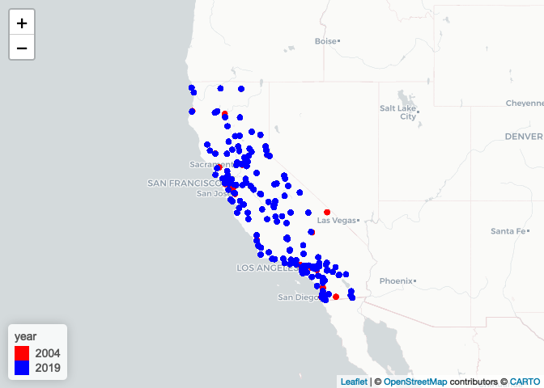
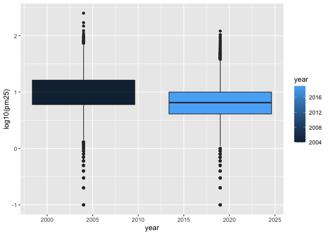

assignment1
================
2022-09-23

``` r
library(data.table)
library(tidyverse)
```

    ## ── Attaching packages ─────────────────────────────────────── tidyverse 1.3.2 ──
    ## ✔ ggplot2 3.3.6      ✔ purrr   0.3.4 
    ## ✔ tibble  3.1.8      ✔ dplyr   1.0.10
    ## ✔ tidyr   1.2.1      ✔ stringr 1.4.1 
    ## ✔ readr   2.1.2      ✔ forcats 0.5.2 
    ## ── Conflicts ────────────────────────────────────────── tidyverse_conflicts() ──
    ## ✖ dplyr::between()   masks data.table::between()
    ## ✖ dplyr::filter()    masks stats::filter()
    ## ✖ dplyr::first()     masks data.table::first()
    ## ✖ dplyr::lag()       masks stats::lag()
    ## ✖ dplyr::last()      masks data.table::last()
    ## ✖ purrr::transpose() masks data.table::transpose()

``` r
library(dplyr)
knitr::opts_chunk$set(echo = TRUE)
library(ggplot2)
library(leaflet)
library(lubridate)
```

    ## 
    ## Attaching package: 'lubridate'
    ## 
    ## The following objects are masked from 'package:data.table':
    ## 
    ##     hour, isoweek, mday, minute, month, quarter, second, wday, week,
    ##     yday, year
    ## 
    ## The following objects are masked from 'package:base':
    ## 
    ##     date, intersect, setdiff, union

``` r
library(skimr)
library(readr)
```

## step 1 check the dimensions, headers, footers, variable names and variable types. Check for any data issues, particularly in the key variable we are analyzing.

``` r
data_2004 <- data.table::fread("../assignment1/data_2004.csv")
data_2019 <- data.table::fread("../assignment1/data_2019.csv")
```

## check the dimensions and headers and footers of the data

``` r
dim(data_2004)
```

    ## [1] 19233    20

``` r
head(data_2004)
```

    ##          Date Source  Site ID POC Daily Mean PM2.5 Concentration    UNITS
    ## 1: 01/01/2004    AQS 60010007   1                            8.9 ug/m3 LC
    ## 2: 01/02/2004    AQS 60010007   1                           12.2 ug/m3 LC
    ## 3: 01/03/2004    AQS 60010007   1                           16.5 ug/m3 LC
    ## 4: 01/04/2004    AQS 60010007   1                           19.5 ug/m3 LC
    ## 5: 01/05/2004    AQS 60010007   1                           11.5 ug/m3 LC
    ## 6: 01/06/2004    AQS 60010007   1                           32.5 ug/m3 LC
    ##    DAILY_AQI_VALUE Site Name DAILY_OBS_COUNT PERCENT_COMPLETE
    ## 1:              37 Livermore               1              100
    ## 2:              51 Livermore               1              100
    ## 3:              60 Livermore               1              100
    ## 4:              67 Livermore               1              100
    ## 5:              48 Livermore               1              100
    ## 6:              94 Livermore               1              100
    ##    AQS_PARAMETER_CODE                     AQS_PARAMETER_DESC CBSA_CODE
    ## 1:              88101               PM2.5 - Local Conditions     41860
    ## 2:              88502 Acceptable PM2.5 AQI & Speciation Mass     41860
    ## 3:              88502 Acceptable PM2.5 AQI & Speciation Mass     41860
    ## 4:              88502 Acceptable PM2.5 AQI & Speciation Mass     41860
    ## 5:              88502 Acceptable PM2.5 AQI & Speciation Mass     41860
    ## 6:              88502 Acceptable PM2.5 AQI & Speciation Mass     41860
    ##                            CBSA_NAME STATE_CODE      STATE COUNTY_CODE  COUNTY
    ## 1: San Francisco-Oakland-Hayward, CA          6 California           1 Alameda
    ## 2: San Francisco-Oakland-Hayward, CA          6 California           1 Alameda
    ## 3: San Francisco-Oakland-Hayward, CA          6 California           1 Alameda
    ## 4: San Francisco-Oakland-Hayward, CA          6 California           1 Alameda
    ## 5: San Francisco-Oakland-Hayward, CA          6 California           1 Alameda
    ## 6: San Francisco-Oakland-Hayward, CA          6 California           1 Alameda
    ##    SITE_LATITUDE SITE_LONGITUDE
    ## 1:      37.68753      -121.7842
    ## 2:      37.68753      -121.7842
    ## 3:      37.68753      -121.7842
    ## 4:      37.68753      -121.7842
    ## 5:      37.68753      -121.7842
    ## 6:      37.68753      -121.7842

``` r
tail(data_2004)
```

    ##          Date Source  Site ID POC Daily Mean PM2.5 Concentration    UNITS
    ## 1: 12/14/2004    AQS 61131003   1                             11 ug/m3 LC
    ## 2: 12/17/2004    AQS 61131003   1                             16 ug/m3 LC
    ## 3: 12/20/2004    AQS 61131003   1                             17 ug/m3 LC
    ## 4: 12/23/2004    AQS 61131003   1                              9 ug/m3 LC
    ## 5: 12/26/2004    AQS 61131003   1                             24 ug/m3 LC
    ## 6: 12/29/2004    AQS 61131003   1                              9 ug/m3 LC
    ##    DAILY_AQI_VALUE            Site Name DAILY_OBS_COUNT PERCENT_COMPLETE
    ## 1:              46 Woodland-Gibson Road               1              100
    ## 2:              59 Woodland-Gibson Road               1              100
    ## 3:              61 Woodland-Gibson Road               1              100
    ## 4:              38 Woodland-Gibson Road               1              100
    ## 5:              76 Woodland-Gibson Road               1              100
    ## 6:              38 Woodland-Gibson Road               1              100
    ##    AQS_PARAMETER_CODE       AQS_PARAMETER_DESC CBSA_CODE
    ## 1:              88101 PM2.5 - Local Conditions     40900
    ## 2:              88101 PM2.5 - Local Conditions     40900
    ## 3:              88101 PM2.5 - Local Conditions     40900
    ## 4:              88101 PM2.5 - Local Conditions     40900
    ## 5:              88101 PM2.5 - Local Conditions     40900
    ## 6:              88101 PM2.5 - Local Conditions     40900
    ##                                  CBSA_NAME STATE_CODE      STATE COUNTY_CODE
    ## 1: Sacramento--Roseville--Arden-Arcade, CA          6 California         113
    ## 2: Sacramento--Roseville--Arden-Arcade, CA          6 California         113
    ## 3: Sacramento--Roseville--Arden-Arcade, CA          6 California         113
    ## 4: Sacramento--Roseville--Arden-Arcade, CA          6 California         113
    ## 5: Sacramento--Roseville--Arden-Arcade, CA          6 California         113
    ## 6: Sacramento--Roseville--Arden-Arcade, CA          6 California         113
    ##    COUNTY SITE_LATITUDE SITE_LONGITUDE
    ## 1:   Yolo      38.66121      -121.7327
    ## 2:   Yolo      38.66121      -121.7327
    ## 3:   Yolo      38.66121      -121.7327
    ## 4:   Yolo      38.66121      -121.7327
    ## 5:   Yolo      38.66121      -121.7327
    ## 6:   Yolo      38.66121      -121.7327

``` r
dim(data_2019)
```

    ## [1] 53156    20

``` r
head(data_2019)
```

    ##          Date Source  Site ID POC Daily Mean PM2.5 Concentration    UNITS
    ## 1: 01/01/2019    AQS 60010007   3                            5.7 ug/m3 LC
    ## 2: 01/02/2019    AQS 60010007   3                           11.9 ug/m3 LC
    ## 3: 01/03/2019    AQS 60010007   3                           20.1 ug/m3 LC
    ## 4: 01/04/2019    AQS 60010007   3                           28.8 ug/m3 LC
    ## 5: 01/05/2019    AQS 60010007   3                           11.2 ug/m3 LC
    ## 6: 01/06/2019    AQS 60010007   3                            2.7 ug/m3 LC
    ##    DAILY_AQI_VALUE Site Name DAILY_OBS_COUNT PERCENT_COMPLETE
    ## 1:              24 Livermore               1              100
    ## 2:              50 Livermore               1              100
    ## 3:              68 Livermore               1              100
    ## 4:              86 Livermore               1              100
    ## 5:              47 Livermore               1              100
    ## 6:              11 Livermore               1              100
    ##    AQS_PARAMETER_CODE       AQS_PARAMETER_DESC CBSA_CODE
    ## 1:              88101 PM2.5 - Local Conditions     41860
    ## 2:              88101 PM2.5 - Local Conditions     41860
    ## 3:              88101 PM2.5 - Local Conditions     41860
    ## 4:              88101 PM2.5 - Local Conditions     41860
    ## 5:              88101 PM2.5 - Local Conditions     41860
    ## 6:              88101 PM2.5 - Local Conditions     41860
    ##                            CBSA_NAME STATE_CODE      STATE COUNTY_CODE  COUNTY
    ## 1: San Francisco-Oakland-Hayward, CA          6 California           1 Alameda
    ## 2: San Francisco-Oakland-Hayward, CA          6 California           1 Alameda
    ## 3: San Francisco-Oakland-Hayward, CA          6 California           1 Alameda
    ## 4: San Francisco-Oakland-Hayward, CA          6 California           1 Alameda
    ## 5: San Francisco-Oakland-Hayward, CA          6 California           1 Alameda
    ## 6: San Francisco-Oakland-Hayward, CA          6 California           1 Alameda
    ##    SITE_LATITUDE SITE_LONGITUDE
    ## 1:      37.68753      -121.7842
    ## 2:      37.68753      -121.7842
    ## 3:      37.68753      -121.7842
    ## 4:      37.68753      -121.7842
    ## 5:      37.68753      -121.7842
    ## 6:      37.68753      -121.7842

``` r
tail(data_2019)
```

    ##          Date Source  Site ID POC Daily Mean PM2.5 Concentration    UNITS
    ## 1: 11/11/2019    AQS 61131003   1                           13.5 ug/m3 LC
    ## 2: 11/17/2019    AQS 61131003   1                           18.1 ug/m3 LC
    ## 3: 11/29/2019    AQS 61131003   1                           12.5 ug/m3 LC
    ## 4: 12/17/2019    AQS 61131003   1                           23.8 ug/m3 LC
    ## 5: 12/23/2019    AQS 61131003   1                            1.0 ug/m3 LC
    ## 6: 12/29/2019    AQS 61131003   1                            9.1 ug/m3 LC
    ##    DAILY_AQI_VALUE            Site Name DAILY_OBS_COUNT PERCENT_COMPLETE
    ## 1:              54 Woodland-Gibson Road               1              100
    ## 2:              64 Woodland-Gibson Road               1              100
    ## 3:              52 Woodland-Gibson Road               1              100
    ## 4:              76 Woodland-Gibson Road               1              100
    ## 5:               4 Woodland-Gibson Road               1              100
    ## 6:              38 Woodland-Gibson Road               1              100
    ##    AQS_PARAMETER_CODE       AQS_PARAMETER_DESC CBSA_CODE
    ## 1:              88101 PM2.5 - Local Conditions     40900
    ## 2:              88101 PM2.5 - Local Conditions     40900
    ## 3:              88101 PM2.5 - Local Conditions     40900
    ## 4:              88101 PM2.5 - Local Conditions     40900
    ## 5:              88101 PM2.5 - Local Conditions     40900
    ## 6:              88101 PM2.5 - Local Conditions     40900
    ##                                  CBSA_NAME STATE_CODE      STATE COUNTY_CODE
    ## 1: Sacramento--Roseville--Arden-Arcade, CA          6 California         113
    ## 2: Sacramento--Roseville--Arden-Arcade, CA          6 California         113
    ## 3: Sacramento--Roseville--Arden-Arcade, CA          6 California         113
    ## 4: Sacramento--Roseville--Arden-Arcade, CA          6 California         113
    ## 5: Sacramento--Roseville--Arden-Arcade, CA          6 California         113
    ## 6: Sacramento--Roseville--Arden-Arcade, CA          6 California         113
    ##    COUNTY SITE_LATITUDE SITE_LONGITUDE
    ## 1:   Yolo      38.66121      -121.7327
    ## 2:   Yolo      38.66121      -121.7327
    ## 3:   Yolo      38.66121      -121.7327
    ## 4:   Yolo      38.66121      -121.7327
    ## 5:   Yolo      38.66121      -121.7327
    ## 6:   Yolo      38.66121      -121.7327

## Check the variable types in the data

``` r
str(data_2004)
```

    ## Classes 'data.table' and 'data.frame':   19233 obs. of  20 variables:
    ##  $ Date                          : chr  "01/01/2004" "01/02/2004" "01/03/2004" "01/04/2004" ...
    ##  $ Source                        : chr  "AQS" "AQS" "AQS" "AQS" ...
    ##  $ Site ID                       : int  60010007 60010007 60010007 60010007 60010007 60010007 60010007 60010007 60010007 60010007 ...
    ##  $ POC                           : int  1 1 1 1 1 1 1 1 1 1 ...
    ##  $ Daily Mean PM2.5 Concentration: num  8.9 12.2 16.5 19.5 11.5 32.5 15.5 29.9 21 15.7 ...
    ##  $ UNITS                         : chr  "ug/m3 LC" "ug/m3 LC" "ug/m3 LC" "ug/m3 LC" ...
    ##  $ DAILY_AQI_VALUE               : int  37 51 60 67 48 94 58 88 70 59 ...
    ##  $ Site Name                     : chr  "Livermore" "Livermore" "Livermore" "Livermore" ...
    ##  $ DAILY_OBS_COUNT               : int  1 1 1 1 1 1 1 1 1 1 ...
    ##  $ PERCENT_COMPLETE              : num  100 100 100 100 100 100 100 100 100 100 ...
    ##  $ AQS_PARAMETER_CODE            : int  88101 88502 88502 88502 88502 88502 88502 88502 88502 88101 ...
    ##  $ AQS_PARAMETER_DESC            : chr  "PM2.5 - Local Conditions" "Acceptable PM2.5 AQI & Speciation Mass" "Acceptable PM2.5 AQI & Speciation Mass" "Acceptable PM2.5 AQI & Speciation Mass" ...
    ##  $ CBSA_CODE                     : int  41860 41860 41860 41860 41860 41860 41860 41860 41860 41860 ...
    ##  $ CBSA_NAME                     : chr  "San Francisco-Oakland-Hayward, CA" "San Francisco-Oakland-Hayward, CA" "San Francisco-Oakland-Hayward, CA" "San Francisco-Oakland-Hayward, CA" ...
    ##  $ STATE_CODE                    : int  6 6 6 6 6 6 6 6 6 6 ...
    ##  $ STATE                         : chr  "California" "California" "California" "California" ...
    ##  $ COUNTY_CODE                   : int  1 1 1 1 1 1 1 1 1 1 ...
    ##  $ COUNTY                        : chr  "Alameda" "Alameda" "Alameda" "Alameda" ...
    ##  $ SITE_LATITUDE                 : num  37.7 37.7 37.7 37.7 37.7 ...
    ##  $ SITE_LONGITUDE                : num  -122 -122 -122 -122 -122 ...
    ##  - attr(*, ".internal.selfref")=<externalptr>

``` r
str(data_2019)
```

    ## Classes 'data.table' and 'data.frame':   53156 obs. of  20 variables:
    ##  $ Date                          : chr  "01/01/2019" "01/02/2019" "01/03/2019" "01/04/2019" ...
    ##  $ Source                        : chr  "AQS" "AQS" "AQS" "AQS" ...
    ##  $ Site ID                       : int  60010007 60010007 60010007 60010007 60010007 60010007 60010007 60010007 60010007 60010007 ...
    ##  $ POC                           : int  3 3 3 3 3 3 3 3 3 3 ...
    ##  $ Daily Mean PM2.5 Concentration: num  5.7 11.9 20.1 28.8 11.2 2.7 2.8 7 3.1 7.1 ...
    ##  $ UNITS                         : chr  "ug/m3 LC" "ug/m3 LC" "ug/m3 LC" "ug/m3 LC" ...
    ##  $ DAILY_AQI_VALUE               : int  24 50 68 86 47 11 12 29 13 30 ...
    ##  $ Site Name                     : chr  "Livermore" "Livermore" "Livermore" "Livermore" ...
    ##  $ DAILY_OBS_COUNT               : int  1 1 1 1 1 1 1 1 1 1 ...
    ##  $ PERCENT_COMPLETE              : num  100 100 100 100 100 100 100 100 100 100 ...
    ##  $ AQS_PARAMETER_CODE            : int  88101 88101 88101 88101 88101 88101 88101 88101 88101 88101 ...
    ##  $ AQS_PARAMETER_DESC            : chr  "PM2.5 - Local Conditions" "PM2.5 - Local Conditions" "PM2.5 - Local Conditions" "PM2.5 - Local Conditions" ...
    ##  $ CBSA_CODE                     : int  41860 41860 41860 41860 41860 41860 41860 41860 41860 41860 ...
    ##  $ CBSA_NAME                     : chr  "San Francisco-Oakland-Hayward, CA" "San Francisco-Oakland-Hayward, CA" "San Francisco-Oakland-Hayward, CA" "San Francisco-Oakland-Hayward, CA" ...
    ##  $ STATE_CODE                    : int  6 6 6 6 6 6 6 6 6 6 ...
    ##  $ STATE                         : chr  "California" "California" "California" "California" ...
    ##  $ COUNTY_CODE                   : int  1 1 1 1 1 1 1 1 1 1 ...
    ##  $ COUNTY                        : chr  "Alameda" "Alameda" "Alameda" "Alameda" ...
    ##  $ SITE_LATITUDE                 : num  37.7 37.7 37.7 37.7 37.7 ...
    ##  $ SITE_LONGITUDE                : num  -122 -122 -122 -122 -122 ...
    ##  - attr(*, ".internal.selfref")=<externalptr>

## exclude pm2.5\<0

``` r
data_2004 <- data_2004[data_2004$`Daily Mean PM2.5 Concentration`>=0,]
dim(data_2004)
```

    ## [1] 19232    20

``` r
data_2019 <- data_2019[data_2019$`Daily Mean PM2.5 Concentration`>=0,]
dim(data_2019)
```

    ## [1] 52874    20

## summary data

``` r
summary(data_2004)
```

    ##      Date              Source             Site ID              POC        
    ##  Length:19232       Length:19232       Min.   :60010007   Min.   : 1.000  
    ##  Class :character   Class :character   1st Qu.:60370002   1st Qu.: 1.000  
    ##  Mode  :character   Mode  :character   Median :60658001   Median : 1.000  
    ##                                        Mean   :60588046   Mean   : 1.816  
    ##                                        3rd Qu.:60750006   3rd Qu.: 2.000  
    ##                                        Max.   :61131003   Max.   :12.000  
    ##                                                                           
    ##  Daily Mean PM2.5 Concentration    UNITS           DAILY_AQI_VALUE 
    ##  Min.   :  0.00                 Length:19232       Min.   :  0.00  
    ##  1st Qu.:  6.00                 Class :character   1st Qu.: 25.00  
    ##  Median : 10.10                 Mode  :character   Median : 42.00  
    ##  Mean   : 13.13                                    Mean   : 46.34  
    ##  3rd Qu.: 16.30                                    3rd Qu.: 60.00  
    ##  Max.   :251.00                                    Max.   :301.00  
    ##                                                                    
    ##   Site Name         DAILY_OBS_COUNT PERCENT_COMPLETE AQS_PARAMETER_CODE
    ##  Length:19232       Min.   :1       Min.   :100      Min.   :88101     
    ##  Class :character   1st Qu.:1       1st Qu.:100      1st Qu.:88101     
    ##  Mode  :character   Median :1       Median :100      Median :88101     
    ##                     Mean   :1       Mean   :100      Mean   :88267     
    ##                     3rd Qu.:1       3rd Qu.:100      3rd Qu.:88502     
    ##                     Max.   :1       Max.   :100      Max.   :88502     
    ##                                                                        
    ##  AQS_PARAMETER_DESC   CBSA_CODE      CBSA_NAME           STATE_CODE
    ##  Length:19232       Min.   :12540   Length:19232       Min.   :6   
    ##  Class :character   1st Qu.:31080   Class :character   1st Qu.:6   
    ##  Mode  :character   Median :40140   Mode  :character   Median :6   
    ##                     Mean   :35328                      Mean   :6   
    ##                     3rd Qu.:41860                      3rd Qu.:6   
    ##                     Max.   :49700                      Max.   :6   
    ##                     NA's   :1253                                   
    ##     STATE            COUNTY_CODE        COUNTY          SITE_LATITUDE  
    ##  Length:19232       Min.   :  1.00   Length:19232       Min.   :32.63  
    ##  Class :character   1st Qu.: 37.00   Class :character   1st Qu.:34.07  
    ##  Mode  :character   Median : 65.00   Mode  :character   Median :36.48  
    ##                     Mean   : 58.63                      Mean   :36.23  
    ##                     3rd Qu.: 75.00                      3rd Qu.:38.10  
    ##                     Max.   :113.00                      Max.   :41.71  
    ##                                                                        
    ##  SITE_LONGITUDE  
    ##  Min.   :-124.2  
    ##  1st Qu.:-121.6  
    ##  Median :-119.3  
    ##  Mean   :-119.7  
    ##  3rd Qu.:-117.9  
    ##  Max.   :-115.5  
    ## 

``` r
summary(data_2004$daily_mean_pm2_5_concentration)
```

    ## Length  Class   Mode 
    ##      0   NULL   NULL

``` r
summary(data_2019)
```

    ##      Date              Source             Site ID              POC        
    ##  Length:52874       Length:52874       Min.   :60010007   Min.   : 1.000  
    ##  Class :character   Class :character   1st Qu.:60310004   1st Qu.: 1.000  
    ##  Mode  :character   Mode  :character   Median :60612003   Median : 3.000  
    ##                                        Mean   :60564971   Mean   : 2.572  
    ##                                        3rd Qu.:60771002   3rd Qu.: 3.000  
    ##                                        Max.   :61131003   Max.   :21.000  
    ##                                                                           
    ##  Daily Mean PM2.5 Concentration    UNITS           DAILY_AQI_VALUE 
    ##  Min.   :  0.000                Length:52874       Min.   :  0.00  
    ##  1st Qu.:  4.000                Class :character   1st Qu.: 17.00  
    ##  Median :  6.500                Mode  :character   Median : 27.00  
    ##  Mean   :  7.785                                   Mean   : 30.74  
    ##  3rd Qu.: 10.000                                   3rd Qu.: 42.00  
    ##  Max.   :120.900                                   Max.   :185.00  
    ##                                                                    
    ##   Site Name         DAILY_OBS_COUNT PERCENT_COMPLETE AQS_PARAMETER_CODE
    ##  Length:52874       Min.   :1       Min.   :100      Min.   :88101     
    ##  Class :character   1st Qu.:1       1st Qu.:100      1st Qu.:88101     
    ##  Mode  :character   Median :1       Median :100      Median :88101     
    ##                     Mean   :1       Mean   :100      Mean   :88213     
    ##                     3rd Qu.:1       3rd Qu.:100      3rd Qu.:88502     
    ##                     Max.   :1       Max.   :100      Max.   :88502     
    ##                                                                        
    ##  AQS_PARAMETER_DESC   CBSA_CODE      CBSA_NAME           STATE_CODE
    ##  Length:52874       Min.   :12540   Length:52874       Min.   :6   
    ##  Class :character   1st Qu.:31080   Class :character   1st Qu.:6   
    ##  Mode  :character   Median :40140   Mode  :character   Median :6   
    ##                     Mean   :35820                      Mean   :6   
    ##                     3rd Qu.:41860                      3rd Qu.:6   
    ##                     Max.   :49700                      Max.   :6   
    ##                     NA's   :4179                                   
    ##     STATE            COUNTY_CODE        COUNTY          SITE_LATITUDE  
    ##  Length:52874       Min.   :  1.00   Length:52874       Min.   :32.58  
    ##  Class :character   1st Qu.: 31.00   Class :character   1st Qu.:34.14  
    ##  Mode  :character   Median : 61.00   Mode  :character   Median :36.50  
    ##                     Mean   : 56.35                      Mean   :36.34  
    ##                     3rd Qu.: 77.00                      3rd Qu.:37.96  
    ##                     Max.   :113.00                      Max.   :41.76  
    ##                                                                        
    ##  SITE_LONGITUDE  
    ##  Min.   :-124.2  
    ##  1st Qu.:-121.6  
    ##  Median :-119.8  
    ##  Mean   :-119.8  
    ##  3rd Qu.:-118.1  
    ##  Max.   :-115.5  
    ## 

``` r
summary(data_2019$daily_mean_pm2_5_concentration)
```

    ## Length  Class   Mode 
    ##      0   NULL   NULL

## check missing value

``` r
sum(is.na(data_2004))
```

    ## [1] 1253

``` r
sum(is.na(data_2004$daily_mean_pm2_5_concentration))
```

    ## [1] 0

``` r
sum(is.na(data_2019))
```

    ## [1] 4179

``` r
sum(is.na(data_2019$daily_mean_pm2_5_concentration))
```

    ## [1] 0

``` r
# The number of rows in 2019 is greater than in 2004, which means that the 2019 dataset will carry more energy than 2004. When we examined the distribution of daily mean values of PM2.5 concentrations, we found that PM2.5 concentrations were negative. It turns out that if the atmosphere is clean, the concentration will be zero. But if there is noise in the measurement, there will be a negative number. So we need to get rid of these negative values. According to the daily mean distribution of PM2.5 concentration, the overall mean of PM2.5 concentration in 2019 was lower than that in 2004.
```

## Step 2 Combine the two years of data into one data frame. Use the Date variable to create a new column for year, which will serve as an identifier. Change the names of the key variables so that they are easier to refer to in your code.

``` r
## creat a new column for year
data_2004[, year := 2004]
data_2019[, year := 2019]
pm_data <- rbind(data_2004, data_2019)
```

## Change the names

``` r
pm_data <- as_tibble(pm_data)
```

``` r
pm_data <- pm_data %>%
  rename(pm25 = `Daily Mean PM2.5 Concentration`,
         countycode = COUNTY_CODE,
         county = COUNTY,
         site = `Site Name`,
         lat = SITE_LATITUDE,
         lon = SITE_LONGITUDE,
         )
```

## Step 3 Create a basic map in leaflet() that shows the locations of the sites (make sure to use different colors for each year). Summarize the spatial distribution of the monitoring sites.

``` r
temp.pal <- colorFactor(c("red", "blue"), domain = pm_data$year)
leaflet(pm_data) %>%
  addProviderTiles("CartoDB.Positron") %>%
  addCircles(
    lat = ~lat, lng = ~lon,
    label = ~year, color = ~temp.pal(year),
    opacity = 1, fillOpacity = 1,radius = 500  ) %>%
   addLegend('bottomleft', pal = temp.pal, values = pm_data$year,
            title = 'year', opacity = 1)
```

<!-- -->

``` r
# Looking at the site location map, there are more sites in the 2019 dataset than in 2004. In both years, observation sites were sparsely distributed. Most of the sites are on the coast, and these are usually developed cities with lots of people living there. Due to the influence of human activities, PM2.5 concentrations may be higher than in untouched areas.
```

## step 4 Check for any missing or implausible values of PM 2.5 in the combined dataset. Explore the proportions of each and provide a summary of any temporal patterns you see in these observations.

``` r
sum(is.na(pm_data$pm25))
```

    ## [1] 0

``` r
summary(pm_data$pm25)
```

    ##    Min. 1st Qu.  Median    Mean 3rd Qu.    Max. 
    ##   0.000   4.400   7.300   9.211  11.300 251.000

``` r
# When we examined the distribution of daily mean values of PM2.5 concentrations, we found that PM2.5 concentrations were negative. It turns out that if the atmosphere is clean, the concentration will be zero. But if there is noise in the measurement, there will be a negative number. So we need to get rid of these negative values. In terms of the proportion of PM2.5 concentration, the highest concentrations were 4.4 to 11.3(first to third quartiles). Areas with extremely high PM2.5 concentrations may be biased, leading to higher average concentration levels.
```

## step 5 Explore the main question of interest at three different spatial levels.

``` r
# state
library(ggplot2)
ggplot(data = pm_data)+
  geom_boxplot(mapping=aes(x=year, y=log10(pm25), fill=year,group =year))
```

    ## Warning: Removed 81 rows containing non-finite values (stat_boxplot).

<!-- -->
